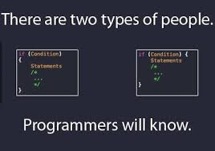

# Coding Style Comparisons 

## Objective
The objective of this study is to establish a standardized coding style for the team, ensuring consistency, readability, and maintainability across the codebase. This includes defining best practices for key aspects such as headers, comments, scoping, classes, and formatting.
Additionally, this study aims to define format style options for configuring the clang-format tool, which will automate code formatting and enforce the agreed-upon style rules. Further details on the configuration and usage of clang-format will be provided later in this module.

<!-- --- -->

## Established Coding Standards
> [LLVM](https://llvm.org/docs/CodingStandards.html#include-style) 
>
> [Google](https://google.github.io/styleguide/cppguide.html)  
>
> [Chromium](https://chromium.googlesource.com/chromium/src/+/refs/heads/main/styleguide/c++/c++.md) (Follows Google C++ Style Guide)
>
> [Mozilla-FireFox](https://firefox-source-docs.mozilla.org/code-quality/coding-style/coding_style_cpp.html)  (adopts parts of the Google Coding style for C++ code)
>
> [GNU](https://www.gnu.org/prep/standards/standards.html)   (Not much Information)


## Table of Contents  
- [Headers](#headers)  
- [Comments](#comments)  
- [Naming Conventions](#naming-conventions)  
- [Formatting and MISC](#formatting-and-misc)    
- [Contributors](#contributors)    

---


<p align="center">
  
</p>


## Headers 
### LLVM
```cpp
//===----------------------------------------------------------------------===//
//
// Part of the LLVM Project, under the Apache License v2.0 with LLVM Exceptions.
// See https://llvm.org/LICENSE.txt for license information.
// SPDX-License-Identifier: Apache-2.0 WITH LLVM-exception
//
//===----------------------------------------------------------------------===//
///
/// \file
/// This file contains the declaration of the Instruction class, which is the
/// base class for all of the VM instructions.
///
//===----------------------------------------------------------------------===//
```
- The first section in the file is a concise note that defines the license that the file is released under. 
- The main body is a Doxygen comment (identified by the /// comment marker instead of the usual //) describing the purpose of the file. 
- The header file’s guard should be the all-caps path that a user of this header would #include.
```cpp
#include "llvm/Analysis/Utils/Local.h" 
// so its guard is LLVM_ANALYSIS_UTILS_LOCAL_H
```
- Include Headers in following order: Main Module Header, Local/Private Headers, LLVM project/subproject headers (clang/..., lldb/..., llvm/..., etc), System #includes
```cpp
#include "foo.h"

#include "utils/logger.h"
#include "core/internal_helper.h"

#include "llvm/Support/raw_ostream.h"
#include "clang/Basic/Diagnostic.h"
#include "lldb/Core/Debugger.h"

#include <iostream>
#include <vector>
#include <string>
```

### Google
- Start each file with license boilerplate.
- If a source file (such as a .h file) declares multiple user-facing abstractions (common functions, related classes, etc.), include a comment describing the collection of those abstractions. Include enough detail for future authors to know what does not fit there.
- Non-header files that are meant for inclusion should end in .inc
- For Header guards, the format of the symbol name should be <PROJECT>_<PATH>_<FILE>_H_
```cpp
#ifndef FOO_BAR_BAZ_H_
#define FOO_BAR_BAZ_H_

// Here Foo is project name
...

#endif  // FOO_BAR_BAZ_H_
```
- foo.cc should include bar.h if it uses a symbol from it even if foo.h includes bar.h. Don't rely on Transitive inclusions
> _A decent rule of thumb is to not inline a function if it is more than 10 lines long_
- Include headers in the following order: Related header, C system headers, C++ standard library headers, other libraries' headers, your project's headers
- Don't include by relative path (Eg;- Don't do this: `#include "../coverage/ccov_xml_tags.h"`)
```cpp
#include "foo/server/fooserver.h"

#include <sys/types.h>
#include <unistd.h>

#include <string>
#include <vector>

#include "base/basictypes.h"
#include "foo/server/bar.h"
#include "third_party/absl/flags/flag.h"
```

<!-- --- -->

## Comments
> _"When writing your comments, write for your audience: the next contributor who will need to understand your code. Be generous — the next one may be you!"_
### LLVM
- `//` for normal & Multi-line comments, `///` for doxygen documentation comments
-  Use C-style `(/* */)` comments in following cases:-
    - constants used as actual parameters in a call
      ```cpp 
      edgc_source_name(rtine, iek_routine, false, true, false); // Don't use this
      edgc_source_name(rtine, iek_routine, /*qualified*/ false, /*template_args*/ true, /*resolved*/ false); // Use this
      ```
- Comment large blocks of code using `#if 0` and `#endif`. These nest properly and are better behaved in general than C style comments

### Google
- Write comments that are  non-obvious
- You can use either the `//` or the `/* */` syntax; however, `//` is much more common. **Be consistent**
- Every non-obvious class or struct declaration should have an accompanying comment that describes what it is for and how it should be used
  ```cpp
  // Holds configuration settings for network requests.
  // - debug: Enables detailed logs if true.
  // - retries: Number of retry attempts before failing.
  struct Config {
      bool debug;
      int retries;
  };
  ```
- Almost every function declaration should have comments immediately preceding it that describe what the function does and how to use it. These comments may be omitted only if the function is simple and obvious
- Types of things to mention in comments at the function declaration:
    - What the inputs and outputs are
    - Explain if a function keeps a reference or pointer beyond the function call
      ```cpp
      public:
      // Stores a reference to `config`. Caller must ensure it remains valid.
      explicit Database(const Config* config) : config_(config) {}
      };
      ```
    - Pointer Arguments: Can It Be `nullptr`?
    - Input/Output Argument Behavior
      ```cpp
      // Inputs:
      //   `filePath` - Path to file.
      // Output:
      //   `buffer` - Overwritten with file contents.
      void readFile(const std::string& filePath, std::string& buffer);
      ```
    - Explain if the function has slow operations, memory use, or expensive calls

- Function Definitions:
  - If there is anything tricky about how a function does its job, the function definition should have an explanatory comment
  - Note you should not just repeat the comments given with the function declaration, in the .h file or wherever
- Use TODO comments for code that is temporary, a short-term solution, or good-enough but not perfect. Syntax:
  ```cpp
  // TODO(<PERSON_NAME>) <BUG_ID>: <CONTEXT_ABOUT_PROBLEM_REFERENCED
  ```


## Naming Conventions

### LLVM
Names should be in camel case (e.g. `TextFileReader` and `isLValue()`)
- **Type names** (including classes, structs, enums, typedefs, etc) should be nouns and start with an upper-case letter (e.g. TextFileReader)
- **Variable names** should be nouns (as they represent state). The name should be camel case, and start with an upper case letter (e.g. Leader or Boats)
- **Function names** should be verb phrases (as they represent actions), and command-like function should be imperative. The name should be camel case, and start with a lower case letter (e.g. openFile() or isFoo())
- **public member variables** should start with an upper-case letter, just like types

### Google
- **Filenames** should be all lowercase and can include underscores (_) or dashes (-), C++ files should have a .cc filename extension, and header files should have a .h extension: `my_useful_class.cc`
- **Type names** start with a capital letter and have a capital letter for each new word, with no underscores (classes, structs, type aliases, enums, and type template parameters)
- **Concept names** follow the same rules as type names
- The names of **variables** (including function parameters) and data members are snake_case (all lowercase, with underscores between words). Data members of classes (but not structs) additionally have trailing underscores. For instance: `a_local_variable, a_struct_data_member, a_class_data_member_`
- **Constant or ConstExpr names** should start with leading _"k"_ followed by mixed case
  ```cpp
  const int kDaysInAWeek = 7;
  const int kAndroid8_0_0 = 24;
  ``` 
- **Function names** should start with a capital letter and have a capital letter for each new word (PascalCase)
- **Namespace names** are all lower-case, with words separated by underscores `frobber_internal`
- **Enumerators** (for both scoped and unscoped enums) should be named like constants, not like macros. That is, use kEnumName not ENUM_NAME.
  ```cpp
  enum class UrlTableError {
    kOk = 0,
    kOutOfMemory,
    kMalformedInput,
  };
  ```
> _"Never use a macro—unless you enjoy debugging errors that look like they were written by a chaotic evil wizard. 😆"_
-  In general macros should not be used. However, if they are absolutely needed, then they should be named with all capitals and underscores


## Formatting and MISC

### LLVM
- Source Code Width: 80 columns to allow developers to open side-by-side windows
- Whitespace: Prefer spaces to tabs
- Do not use RTTI or Exceptions: LLVM does not use exceptions or RTTI ( dynamic_cast<>)
- Prefer C++-style casts
    - When casting. , use static_cast, reinterpret_cast, and const_cast, rather than C-style casts
- Use auto Type Deduction to Make Code More Readable
    - LLVM uses a more moderate stance. Use auto if and only if it makes the code more readable or easier to maintain. Don’t “almost always” use auto, but do use auto with initializers like cast<Foo>(...) or other places where the type is already obvious from the context.
    - The convenience of auto makes it easy to forget that its default behavior is a copy. Particularly in range-based for loops, careless copies are expensive.
    - Use auto & for values and auto * for pointers unless you need to make a copy.
- Use range-based for loops wherever possible
- If normal loops are needed, don’t evaluate end() every time through a loop
  ```cpp
  /* Don't use this */
  BasicBlock *BB = ...
  for (auto I = BB->begin(); I != BB->end(); ++I)
    ... use I ...
    
  /* Use this */
  BasicBlock *BB = ...
  for (auto I = BB->begin(), E = BB->end(); I != E; ++I)
    ... use I ...
  ```
- Spaces before Parentheses & Don’t Use Braces on Simple Single-Statement Bodies of if/else/loop Statements
  ```cpp
  if (X) ...
  for (I = 0; I != 100; ++I) ...
  while (LLVMRocks) ...
  somefunc(42, 92);
  ```
- Namespace Indentation
  - Don't indent namespaces, easier to understand the code.
  - Add a comment indicating what namespace is being closed
  ```cpp
  namespace llvm {
  namespace knowledge {

  /// This class represents things that Smith can have an intimate
  /// understanding of and contains the data associated with it.
  class Grokable {
  ...
  public:
    explicit Grokable() { ... }
    virtual ~Grokable() = 0;

    ...

  };

  } // namespace knowledge
  } // namespace llvm
  ```

### Google

- Local Variables: initialize variables in the declaration
- Class
  - Group similar declarations together, placing public parts earlier.
  - A class definition should usually start with a public: section, followed by protected:, then private:. Omit sections that would be empty.(access specifiers should be indented to 1 space)

- Write Short Functions: If a function exceeds about 40 lines, think about whether it can be broken up without harming the structure of the program
- Trailing Return Type Syntax: Use trailing return types only where using the ordinary syntax (leading return types) is impractical or much less readable.
  ```cpp
  template <typename T, typename U>
    auto add(T t, U u) -> decltype(t + u);
  auto foo(int x) -> int;
  ```
- Run-Time Type Information (RTTI): Avoid using run-time type information (RTTI). RTTI allows a programmer to query the C++ class of an object at run-time. This is done by use of typeid or dynamic_cast. 
- Casting: Use C++-style casts like static_cast<float>(double_value), or brace initialization for conversion of arithmetic types like int64_t y = int64_t{1} << 42. Do not use cast formats like (int)x unless the cast is to void. You may use cast formats like T(x) only when T is a class type.
- Preincrement and Predecrement: Use the prefix form (++i) of the increment and decrement operators unless you need postfix semantics.
- Line should be 80 characters long
- Spaces vs. Tabs: Use only spaces, and indent 2 spaces at a time.
- Function Declarations and Definitions: Return type on the same line as function name, parameters on the same line if they fit. Wrap parameter lists which do not fit on a single line as you would wrap arguments in a function call
  ```cpp
  ReturnType ClassName::FunctionName(Type par_name1, Type par_name2) {
    DoSomething();
    ...
  }
  //If you have too much text to fit on one line:

  ReturnType ClassName::ReallyLongFunctionName(Type par_name1, Type par_name2,
                                               Type par_name3) {
    DoSomething();
    ...
  }
  //or if you cannot fit even the first parameter:

  ReturnType LongClassName::ReallyReallyReallyLongFunctionName(
      Type par_name1,  // 4 space indent
      Type par_name2,
      Type par_name3) {
    DoSomething();  // 2 space indent
    ...
  ```
- Function Calls: If the arguments do not all fit on one line, they should be broken up onto multiple lines, with each subsequent line aligned with the first argument. Do not add spaces after the open paren or before the close paren
  ```cpp
  bool result = DoSomething(argument1, argument2, argument3);

  bool result = DoSomething(averyveryveryverylongargument1,
                            argument2, argument3);
  ```
- Looping and branching statements: (if, else, switch, while, do, or for)
  - The components of the statement should be separated by single spaces (not line breaks).
  - Inside the condition or iteration specifier, do not put a space after the opening parenthesis or before the closing parenthesis.

- Boolean Expressions: When you have a boolean expression that is longer than the standard line length, be consistent in how you break up the lines.
  In this example, the logical AND operator is always at the end of the lines:
  ```cpp
  if (this_one_thing > this_other_thing &&
      a_third_thing == a_fourth_thing &&
      yet_another && last_one) {
    ...
  }
  ```
- Class Format: Sections in public, protected and private order, each indented one space. Do not leave a blank line after these keywords
  - The public section should be first, followed by the protected and finally the private section
  - The basic format for a class definition:
  ```cpp
  class MyClass : public OtherClass {
   public:      // Note the 1 space indent!
    MyClass();  // Regular 2 space indent.
    explicit MyClass(int var);
    ~MyClass() {}

    void SomeFunction();
    void SomeFunctionThatDoesNothing() {
    }

    void set_some_var(int var) { some_var_ = var; }
    int some_var() const { return some_var_; }

   private:
    bool SomeInternalFunction();

    int some_var_;
    int some_other_var_;
  };
  ```

## Contributors
_Rohith Namavaram_
